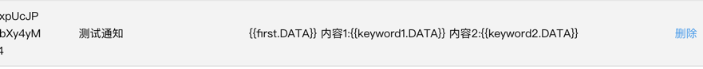
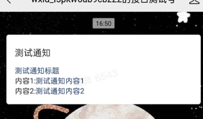

### 🎯 微信公众号组件

> 本组件致力于为开发公众号项目提供最大便捷，通过引入本组件可极速构建一套微信公众号项目，组件的功能不断完善中...
---
### 🚀 技术架构

|  技术栈   |  版本  |
|  ----  | ----  | 
| Java   | 1.8 | 
| maven  | 3.6.2 | 
| springboot  | 2.0.3.RELEASE | 
---
### 🧩 组件介绍

|  组件   |  版本  | 描述  | 
|  ----  | ----  | ----  | 
| wechat-project-config   | 1.0-SNAPSHOT | 公共配置信息 如appId appSecret | 
| wechat-project-authrization  | 1.0-SNAPSHOT | wechat授权的业务 如获取access_token，并定时重置 | 
| wechat-project-notify  | 1.0-SNAPSHOT | 给订阅者发送微信通知消息 | 
---
### 🔑 引入组件

- 通过maven依赖

```
<dependencies>
    <dependency>
        <groupId>cn.xuben99</groupId>
        <artifactId>wechat-project-notify</artifactId>
        <version>1.0-SNAPSHOT</version>
    </dependency>
</dependencies>
```
---
### 🔐 如何使用
- 前期配置
```
# 在配置文件application.yml中配置
# 必须配置，否则组件无法正常运行
wechat:
  signature:
    appId: 微信公众号的appId
    appSecret: 微信公众号的appSecret
```

- 如何获取access_token
```java
//从容器中获取缓存对象
@Autowired
private WechatTokenCache wechatTokenCache;
//获取access_token值
wechatTokenCache.getWechatToken();
```
- 如何发送通知消息
```java
//从容器中获取对象
@Autowired
private WechatNotifySender wechatNotifySender;
//发送通知消息
public void testSendNotify() {
    List<WechatNotifyDto> waitSendNotify = Lists.newArrayList();
    Map<String, WechatNotifyDataDto> data = Maps.newHashMap();
    data.put("first", new WechatNotifyDataDto("测试通知标题", "#173177"));
    data.put("keyword1", new WechatNotifyDataDto("测试通知内容1", "#173177"));
    data.put("keyword2", new WechatNotifyDataDto("测试通知内容2", "#173177"));
    WechatNotifyDto dto = new WechatNotifyDto();
    dto.setTouser("订阅者的openId");
    dto.setTemplate_id("微信后台定义的模版ID");
    dto.setData(data);
    waitSendNotify.add(dto);
    wechatNotifySender.sendWechatNotify(waitSendNotify);
}
```
⚙️ 微信后台模板模板配置 示例


✅ 结果测试



---
### ☕ 创作不易 打赏作者 


--- 
### ☎️ 联系作者

- ✉️ zghbxll@gmail.com

--- 
###  🐛 bug反馈与咨询

- bug 或 疑问咨询 可提交`Issues`，或`邮件`联系


